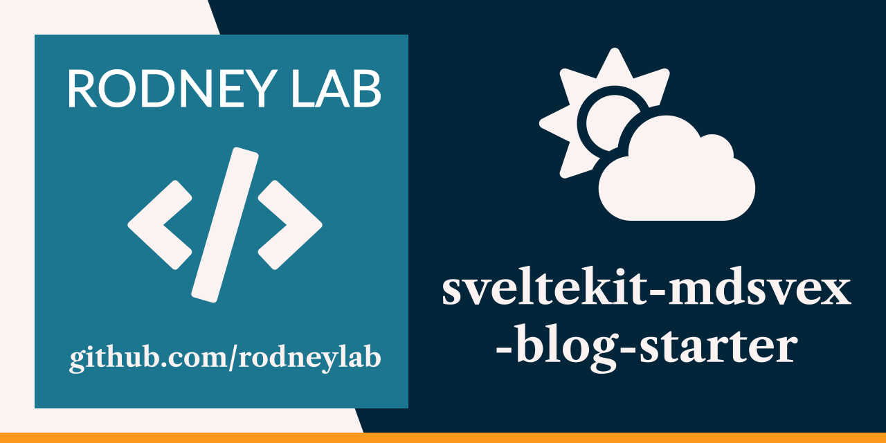
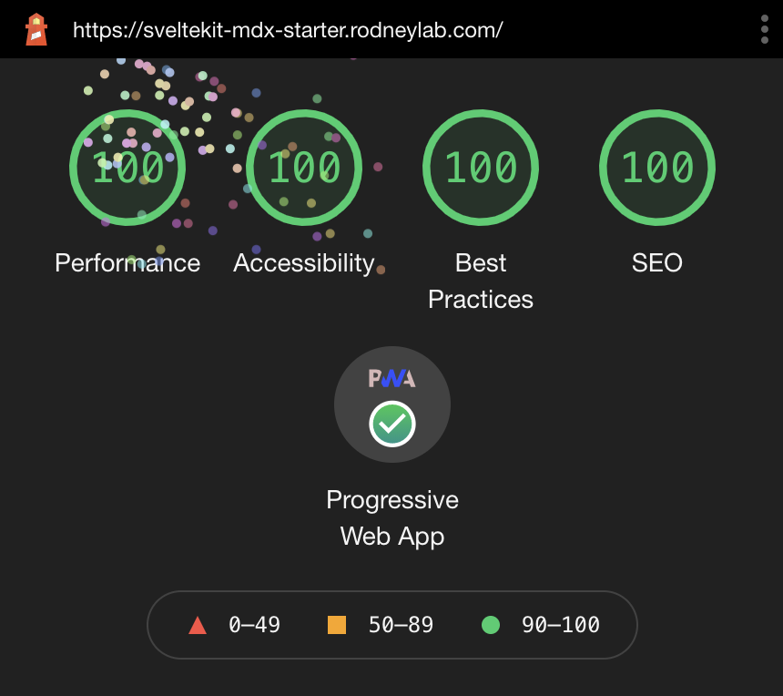

<p align="center">
  <a aria-label="Open Rodney Lab site" href="https://rodneylab.com" rel="nofollow noopener noreferrer">
    
  </a>
</p>
<h1 align="center">
  SvelteKit MDsvex Blog Starter
</h1>

[](https://app.netlify.com/sites/zealous-jackson-f2037b/deploys)

# sveltekit-blog-mdx

[](https://open.vscode.dev/rodneylab/sveltekit-blog-mdx)

SvelteKit blog starter to help you get going on your next Svelte blog site. The project <a aria-label="Read about how to customise the P W A functionality" href="https://rodneylab.com/sveltekit-pwa/">creates a Progressive Web App (PWA)</a> out of the box. You just need to customise with your logos etc.



See the [Sveltekit Blog Starter blog post on the Rodney Lab site](https://rodneylab.com/sveltekit-blog-starter/) for some explanation of what's inside and how to customise. Please drop questions into a comment at the bottom of that page.

Here's the quick start:

Everything you need to build a Svelte blog site, powered by [`sveltekit-blog-mdx`](https://github.com/rodneylab/sveltekit-blog-mdx.git).

## Creating your Own MDsveX Blog Site

If you're seeing this, you've probably already done this step. Congrats!

```bash
git clone https://github.com/rodneylab/sveltekit-blog-mdx.git my-new-mdsvex-blog
cd my-new-mdsvex-blog
pnpm install # or npm install
npm run dev
```

### Responsive Images

The starter creates and caches responsive images using the `vite-imagetools` plugin. This is straightforward to use when you know ahead of time which image you want to include. You just import it on the page you want to use it on:

```javascript
import featuredImageSrc from '$lib/assets/home/home.jpg';
```

The `vite-imagetools` plugin will then generate and hash the image. See examples in `src/routes/index.svelte`.

The example where you want to have a different featured image for each blog post is a little more complicated, though manageable. In this case, you can run a script (see `generate-responsive-image-data.js`) to iterate though all blog posts, taking the featured image from the blog post front matter. This script can then output the necessary imports into a generated JavaScript file, one for each blog post (see `src/lib/generated` directory). Finally you can dynamically import that JavaScript file in the blog template load function.

To run the included script at the command like type:

```shell
pnpm run gen:images
```

This should be done each time you add new blog posts. It also generates a low resolution placeholder, to minimise Content Layout shift during page load.

For the script to find your blog post images, add them under the `src/lib/assets/blog` folder. In that folder, create a new folder whose name matches the post slug and add the images to the new folder. The name of the file needs to match the name you use is the post frontmatter (for featuredImage, for example).

The script may need some tweaking for your use case. Let me know how it can be improved.

### XML Sitemap

- If your site is completely static, then you can generate an XML sitemap by running

```shell
npm run generate:sitemap
```

this will be output to `static/sitemap.xml`. You can work this into your build process by updating the `build` script in `package.json` to something like:

```shell
    "build": "npm run generate:manifest && npm run generate:sitemap && svelte-kit build",
```

The generation JavaScript code is in the file `generate-sitemap.js` in the root folder of the project.

- Alternatively, (if your app has server side rendering) the sitemap is automatically served at `https://example.com/sitemap.xml`. It is served by the file at `src/routes/sitemap.xml.js`.

Either way, make sure your site's URL is defined in `.env` as the `VITE_SITE_URL` variable so the correct URLs are output to the site map.

### Progressive Web App (PWA)

The starter mostly generates PWA config automatically, including service worker for offline availability and adding meta to the HTML head section. A PWA needs a manifest file detailing logos (for favicons) in different sizes, compatible with various devices. The starter can generate the logo in different sizes automatically if you create a 512&nbsp;px&nbsp;&times;&nbsp;512&nbsp;px logo and save it as `static/icon.png`. Then run

```shell
npm run generate:manifest
```

The script outputs the manifest file to `static/manifest.json` and it is then automatically included in your build.

The HTML meta for PWAs is added in the component at `src/lib/components/PWA.svelte`.

You can customise the manifest (including icon file path) by editing `src/lib/config/website.js`. The following variables feed into the generated `manifest.json` file:

- `siteTitle`,
- `siteShortTitle`,
- `siteUrl`,
- `icon` &mdash; path to template icon,
- `backgroundColor`,
- `themeColor`.

See <a aria-label="Lean more about Progressive Web Apps in Svelte Kit" href="https://rodneylab.com/sveltekit-pwa/">article on Progressive Web Apps in SvelteKit</a> for more.

## Building

```bash
npm run build
```

> You can preview the built app with `npm run preview`, regardless of whether you installed an adapter. This should _not_ be used to serve your app in production.

## What's inside?

```
.
├── README.md
├── generate-manifest.js
├── generate-responsive-image-data.js
├── generate-sitemap.js
├── jsconfig.json
├── netlify.toml
├── package.json
├── src
│   ├── app.html
│   ├── content
│   │   └── blog
│   │       ├── best-medium-format-camera-for-starting-out
│   │       ├── folding-camera
│   │       └── twin-lens-reflex-camera
│   ├── global.d.ts
│   ├── hooks.js
│   ├── lib
│   │   ├── assets
│   │   │   ├── blog
│   │   │   └── home
│   │   ├── components
│   │   │   ├── BannerImage.svelte
│   │   │   └── ...
│   │   ├── config
│   │   │   └── website.js
│   │   ├── constants
│   │   │   └── entities.js
│   │   ├── generated
│   │   │   └── posts
│   │   ├── styles
│   │   └── utilities
│   │       ├── blog.js
│   │       ├── file.js
│   │       └── image.js
│   ├── routes
│   │   ├── [slug]
│   │   │   ├── __layout.svelte
│   │   │   ├── index.json.js
│   │   │   └── index.svelte
│   │   ├── __error.svelte
│   │   ├── __layout.svelte
│   │   ├── contact.svelte
│   │   ├── index.json.js
│   │   ├── index.svelte
│   │   └── sitemap.xml.js
│   └── service-worker.js
├── static
│   ├── assets
│   ├── favicon.png
│   ├── icon.png
│   ├── icons
│   │   ├── icon-128x128.png
│   │   ├── icon-144x144.png
│   │   ├── icon-152x152.png
│   │   ├── icon-192x192.png
│   │   ├── icon-256x256.png
│   │   └── icon-512x512.png
│   ├── manifest.json
│   ├── robots.txt
│   └── sitemap.xml
└── svelte.config.js
```

### `/`

- `generate-manifest.js` script for generating the PWA manifest.json as well as the icons in different sizes.

- `generate-sitemap.js` script for generating an XML sitemap, only needed for static sites, otherwise SvelteKit creates an endpoint from which the sitemap is served (see `src/routes/sitemap.xml.js`).

### `src/content`

- The `src/content/blog` is where we need to put our blog posts. Just clean out the sample content and replace it with your views on the world! There is a separate folder for each post, which allows you to keep images, video and other related media specific to a post better organised. We set the browser path from this folder name, so keep that in mind when naming the folders. Write the actual post in a file called `index.md` within post's folder. Although the file has an `.md` extension, you can write Svelte in it.

### `src`

- `hooks.js` we define Content Security Policy (CSP) and other HTTP security headers in here, effective for server side rendered apps. See <a aria-label="Open post on Svelte Kit stati site H T T P headers" href="https://rodneylab.com/sveltekit-static-site-http-headers/">post on SvelteKit static site HTTP headers</a> to see how to set up CSP etc for static sites.

### `src/components`

- `src/lib/components` these are the components we use in pages.

### `src/lib`

- `src/lib/config/website.js` for convenience we define properties for the site here such as the site title, contact email addresses and social media accounts. Some properties feed from environment variables. See a post on <a aria-label="Read recent Rodney Lab post on Getting Started with Svelte Kit" href="https://rodneylab.com/getting-started-with-sveltekit/#sveltekitEnvironmentVariables">getting started with SvelteKit for more on environment variables in SvelteKit</a>.

- `src/lib/styles` does what you expect! We use SCSS for styling and source self-hosted fonts in the layouts.

### `src/utilities`

- `src/utilities/blog.js` this file contains some code for helping us transform the markdown in blog posts to Svelte. As well as that they help extract fields in the frontmatter (this is the metadata we include at the top fo the blog post `index.md` files).

### `src/routes`

- `src/routes/[slug]/index.json.js` this is essentially a template for blog post data. One of these files is generated at build for each blog post. It is used to extract data needed in the Svelte file used to generate the post's HTML.

- `src/routes/[slug]/index.svelte` similarly to the previous file, one of these is generated for each blog post. This time it is the Svelte code which SvelteKit uses to generate the HTML and JavaScript for our blog posts.

I mention most of the other files in the <a aria-label="Read recent Rodney Lab post on Getting Started with Svelte Kit" href="https://rodneylab.com/getting-started-with-sveltekit/">Getting Started with SvelteKit blog post</a>, but let me know if I have missed anything which needs more explanation.
